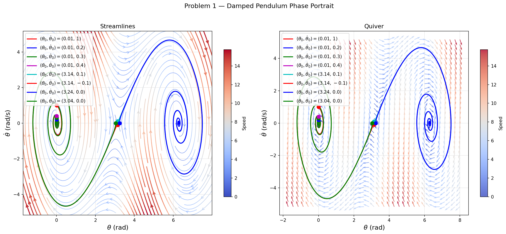
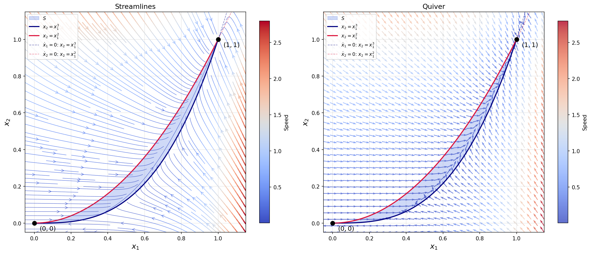
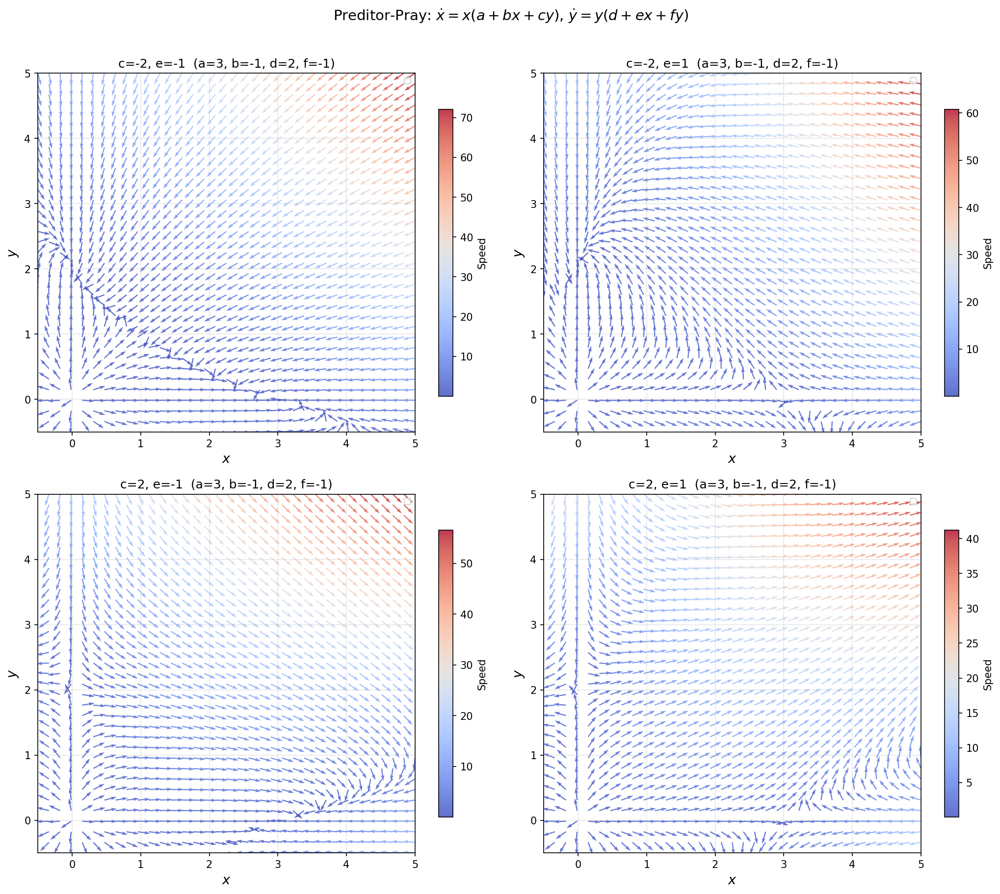

# Advanced Topics - Assignment 1

## Setup

```bash
uv init lyapunov-sos
cd lyapunov-sos
uv venv
source .venv/bin/activate
uv pip install drake cvxpy numpy matplotlib sympy
```

## Results

### Problem 1 - Damped Pendulum Phase Portrait



### Problem 2 - Invariant Set




